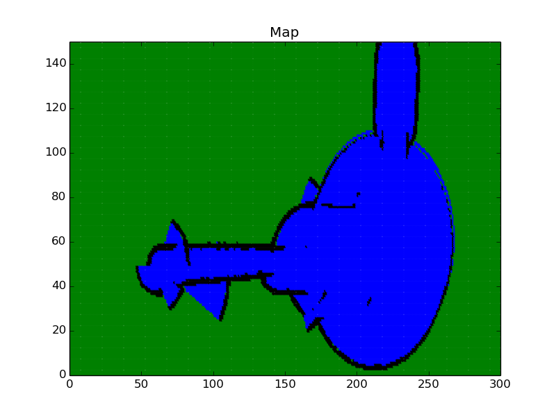

# Occupancy Grid Mapping
This repo contains a C++ implementation of an occupancy grid mapping algorithm using inverse sensor model and recorded measurements

## Compiling the Program

#### Step 1
Install Python2.7 and [matplotlib](https://matplotlib.org/users/installing.html) library


#### Step 2
Clone the respository and build it:

```sh
git clone https://github.com/farzingkh/Occupancy-Grid-Mapping.git
cd Occupancy-Grid-Mapping/
mkdir build
cd build
cmake ..
make
```

and run the application:
```sh
./OGM
```
 
 It uses matplotlibcpp wrapper to access matplotlib functionality. See the visuaization file to change the plotting options. 

### Expected Map
